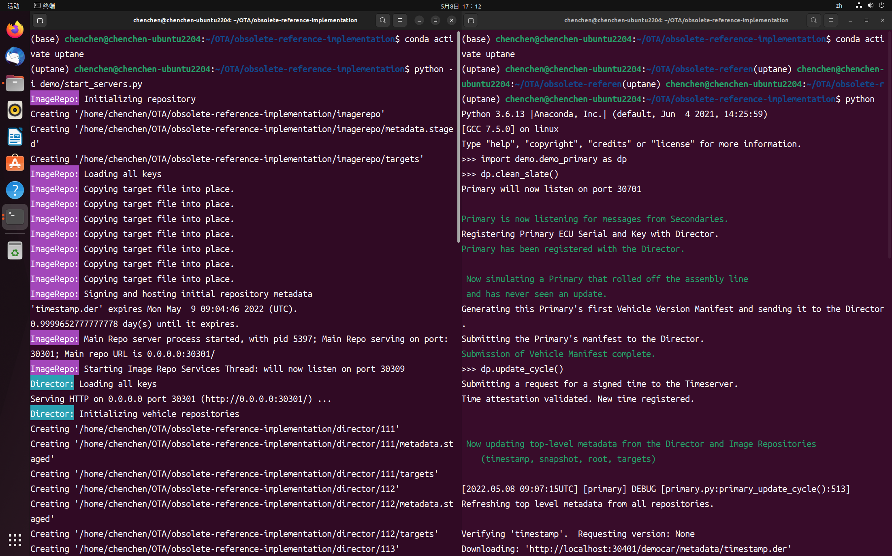
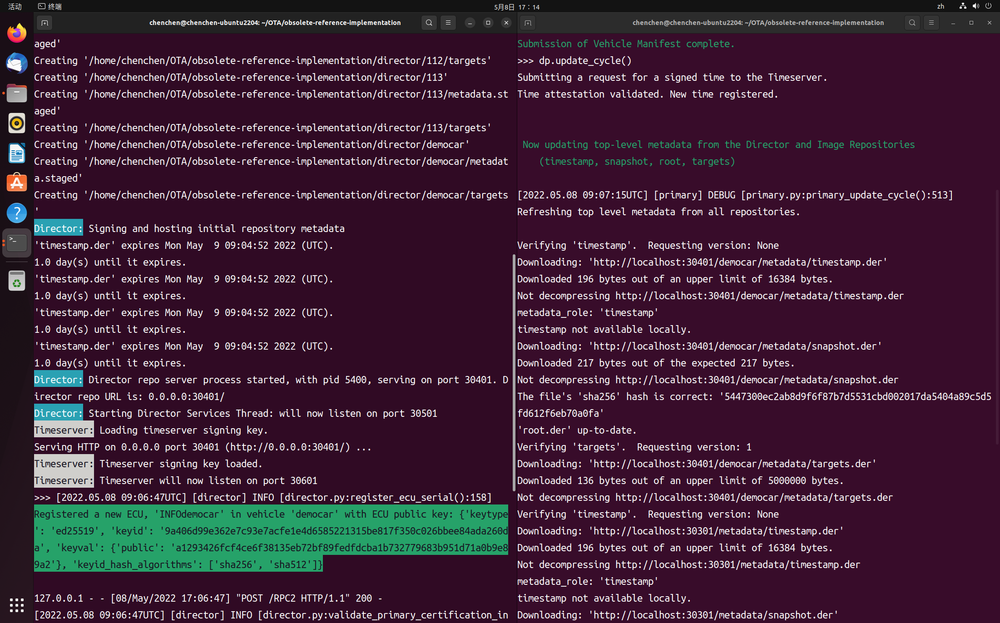
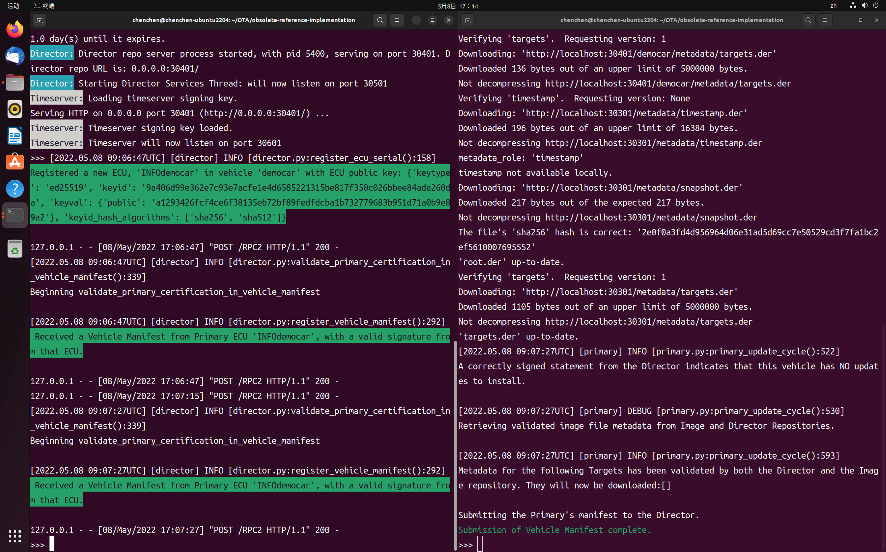

# Uptane_demo_API

[初始化image]: ./image.md
[初始化director]: ./Director.md

[初始化Timeserver]: ./Timeserver

下面开始的主要客户端可能会在车辆中功能更强大且连接更紧密的 ECU 上运行 - 可能是主机/信息娱乐。 它将按照Director的指示从图像存储库中获取元数据和图像，并将它们适当地分发给车辆中的其他辅助 ECU，它将接收指示每个辅助 ECU 上的软件的 ECU 清单，并将它们捆绑到车辆清单中发送给Director。

clean_slate()设置一个从未更新过的新主节点

**update_cycle()**

- 从 Director 和 Image 存储库中获取并验证车辆的所有签名元数据
- 获取 Director 指示此车辆安装的所有图像，不包括与图像存储库中的相应图像不完全匹配的图像。从存储库中获取的任何与经过验证的元数据不匹配的图像都将被丢弃。
- 查询 Timeserver 以获取有关当前时间的签名证明，其中包括辅助节点发送的任何 nonce，以便辅助节点可以相信返回的时间至少与其发送的 nonce 一样新
- 生成车辆版本清单，其中包含一些车辆元数据和从辅助节点接收的所有 ECU 版本清单，描述当前安装的图像、每个 ECU 可用的最近时间以及辅助节点观察到的任何攻击的报告（也可以直接调用：`dp. generate_signed_vehicle_manifest()`)
- 将该车辆版本清单发送给主管（也可以直接调用：`dp.submit_vehicle_manifest_to_director()`）

